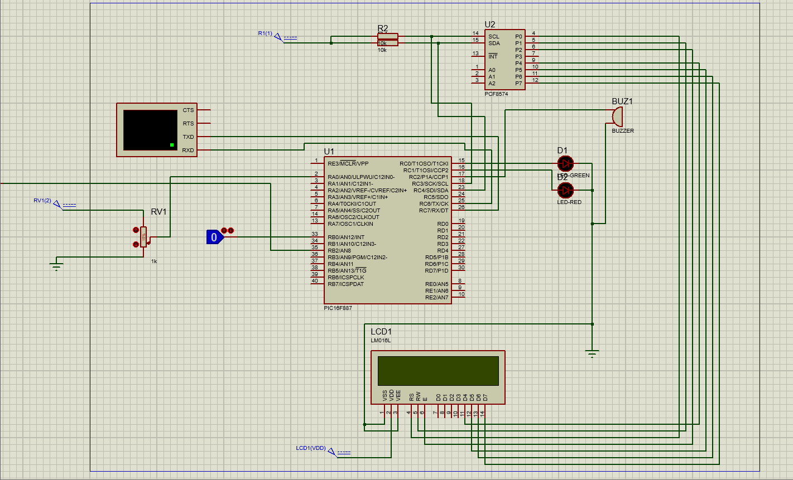
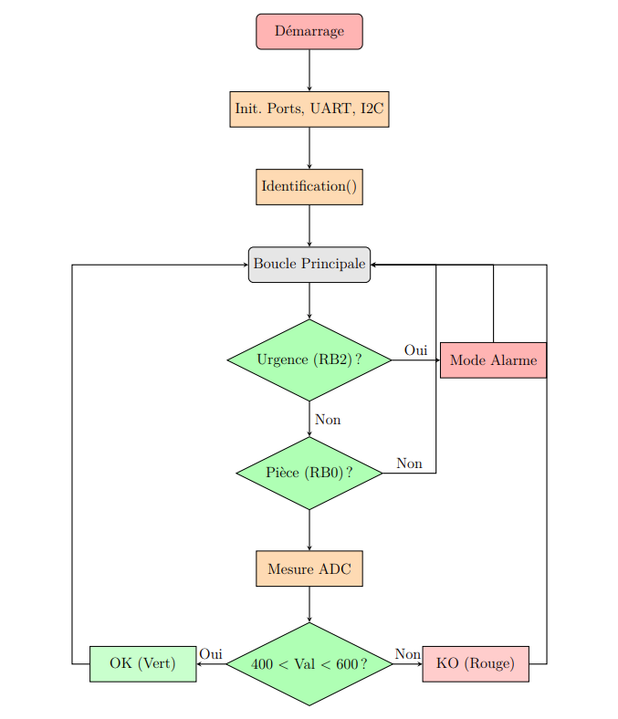

# Smart Workstation System

**Author:** Rami ELAMRI

## Project Overview
The **Smart Workstation System** is an embedded safety and quality control unit for industrial environments. Developed using the **PIC16F887** microcontroller, it automates operator authentication and safety management.

## Key Features
* **Authentication:** Secure login system (PIN: `3103`) preventing unauthorized usage.
* **Safety Priority:** Hard-coded emergency interrupt loop that overrides all other processes.
* **Quality Control:** Analog-to-Digital conversion (ADC) to verify part dimensions within tolerance [400-600].
* **Feedback:** Real-time production stats displayed on an I2C LCD.

## System Architecture
### Circuit Diagram

*The system utilizes a PIC16F887 connected to a Virtual Terminal (UART), I2C LCD, and analog sensors.*

### Software Logic

*The main loop handles production counting while the interrupt handles emergency stops.*

## Technical Stack
* **Microcontroller:** PIC16F887
* **Language:** Embedded C
* **IDE/Compiler:** MikroC for PIC
* **Simulation:** Proteus ISIS